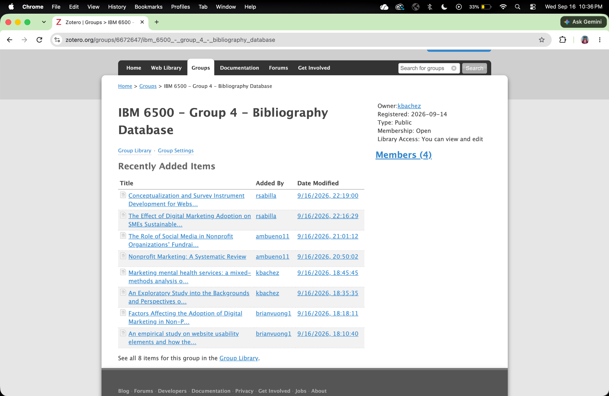
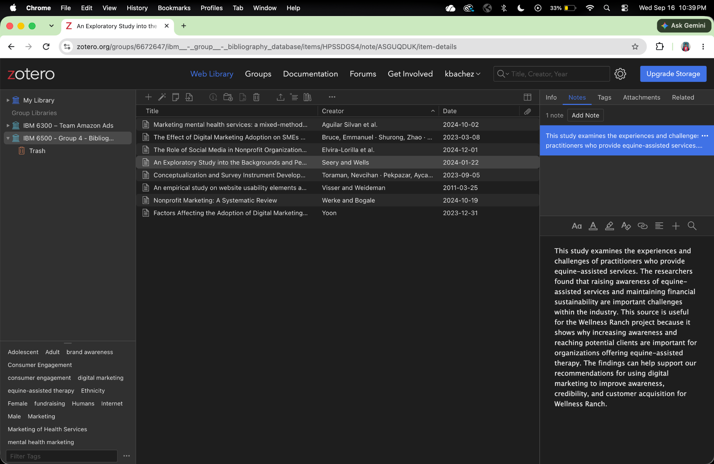
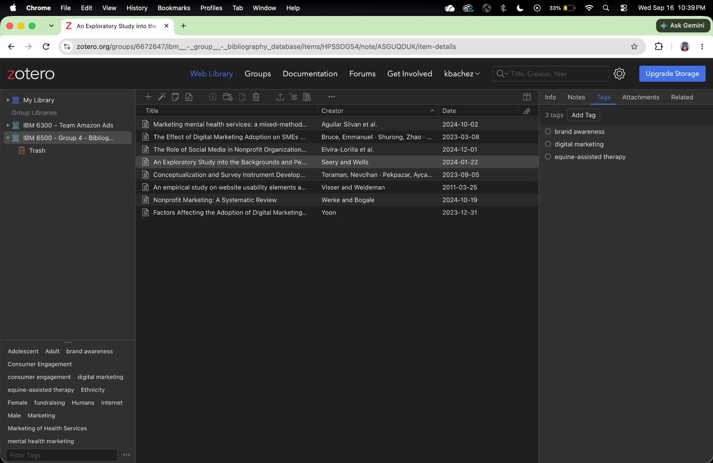
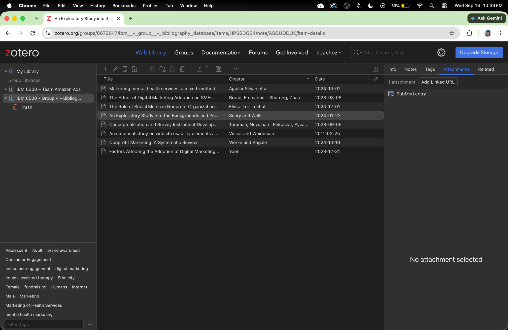

# Introduction

The purpose of this assignment is to create a shared bibliography database using Zotero for our Culminating Experience Project (CEP). Our group is working on **Project 8: Implementing and Optimizing Digital Marketing for Wellness Ranch Equine Assisted Therapy**.

Zotero allows our group to collect, organize, and share academic and professional sources that can support our research and future recommendations. The shared library will also help our group maintain accurate citation information, organize PDFs and links, add notes and tags, and collaborate throughout the CEP.

::: callout-note
## Project Topic

**Project 8: Implementing and Optimizing Digital Marketing for Wellness Ranch Equine Assisted Therapy**

Our sources focus on topics such as digital marketing, website usability, nonprofit marketing, social media, mental health marketing, and equine-assisted services.
:::

# Zotero Group Library

Our group created a shared Zotero library titled **IBM 6500 - Group 4 - Bibliography Database**.

Each group member contributed at least two sources related to our CEP topic. The group library allows us to share sources and organize research in one central location.

Figure @fig-group-library shows the shared Zotero group library and the articles contributed by the members of Group 4.

{#fig-group-library fig-cap="IBM 6500 Group 4 Zotero Bibliography Database showing the sources contributed by each group member."}

# Example Zotero Item

To demonstrate how our sources are organized, the following screenshots show one completed Zotero item from the group library.

The selected article is **An Exploratory Study into the Backgrounds and Perspectives of Equine-Assisted Service Practitioners**.

This source is especially relevant to our project because it focuses directly on equine-assisted services and provides information about challenges experienced by practitioners in this field.

## Citation Information

Figure @fig-citation shows the citation information stored in Zotero.

{#fig-citation fig-cap="Citation information for An Exploratory Study into the Backgrounds and Perspectives of Equine-Assisted Service Practitioners."}

The Zotero record includes important citation information such as the title, authors, publication, publication date, volume, issue, pages, and DOI.

## Notes

A short note was added to explain why the source is useful for our project.

{#fig-notes fig-cap="Zotero note describing how the selected source can support the Wellness Ranch project."}

The note explains that the study examines the experiences and challenges of practitioners who provide equine-assisted services. The source is useful because it helps our group understand challenges related to awareness and sustainability within the industry. These findings can support recommendations for using digital marketing to improve awareness, credibility, and customer acquisition for Wellness Ranch.

## Tags

Tags were added to make the source easier to organize and locate within the group bibliography database.

{#fig-tags fig-cap="Tags used to organize the selected Zotero source."}

The three tags used for this source are:

-   **brand awareness**
-   **digital marketing**
-   **equine-assisted therapy**

These tags represent the major topics that connect the article to the Wellness Ranch project.

## Attachment

The Zotero item also contains an attachment that provides access to the original source.

{#fig-attachment fig-cap="Attachment associated with the selected Zotero source."}

Having the original source linked to the Zotero record makes it easier for group members to access the article while conducting research.

# Group Source Summary Table

The following table summarizes the sources contributed by each group member to the Zotero group library. These sources support the development of digital marketing recommendations for Wellness Ranch Equine Assisted Therapy.

| Source Title | Contributed By | Type of Source | Why This Source Is Useful |
|------------------|------------------|------------------|------------------|
| Conceptualization and Survey Instrument Development for Website Usability | Ron Sabilla | Peer-Reviewed Journal Article | This source identifies important elements of website usability from the perspective of users. Wellness Ranch can use these concepts to evaluate its website and improve the online experience for potential clients. |
| The Effect of Digital Marketing Adoption on SMEs Sustainable Growth: Empirical Evidence from Ghana | Ron Sabilla | Empirical Journal Article | This source examines digital marketing adoption and business growth. It can help the group understand how implementing digital marketing strategies may support the long-term growth and sustainability of Wellness Ranch. |
| The Role of Social Media in Nonprofit Organizations' Fundraising | Alexa Bueno | Research Journal Article | This source examines how nonprofit organizations use social media for fundraising. It can help Wellness Ranch develop social media strategies that increase engagement, expand its audience, and support fundraising efforts. |
| Nonprofit Marketing: A Systematic Review | Alexa Bueno | Systematic Review | This source provides an overview of research on nonprofit marketing. It can help the group identify established marketing strategies and concepts that could be applied to Wellness Ranch's digital marketing plan. |
| Marketing Mental Health Services: A Mixed-Methods Analysis of Racially and Ethnically Diverse College Students' Engagement With and Perspectives on U.S. University Mental Health Clinics' Websites | Kevin Bachez | Mixed-Methods Journal Article | This source examines how people respond to websites that market mental health services. The findings can help Wellness Ranch improve how it presents information about equine-assisted therapy online and make its website more informative, engaging, and trustworthy. |
| An Exploratory Study into the Backgrounds and Perspectives of Equine-Assisted Service Practitioners | Kevin Bachez | Peer-Reviewed Journal Article | This source focuses directly on practitioners who provide equine-assisted services. It can help the group understand challenges within the industry and support recommendations for increasing awareness of Wellness Ranch and its equine-assisted therapy services. |
| Factors Affecting the Adoption of Digital Marketing in Non-Profit Organizations: An Empirical Study | Brian Vuong | Empirical Journal Article | This source examines factors that influence whether nonprofit organizations adopt digital marketing. It can help the group identify potential barriers and considerations Wellness Ranch may face when implementing and improving its digital marketing strategy. |
| An Empirical Study on Website Usability Elements and How They Affect Search Engine Optimisation | Brian Vuong | Empirical Journal Article | This source connects website usability with search engine optimization. It can support recommendations for improving the Wellness Ranch website so it is easier for visitors to use while also increasing its visibility in search engines. |

# Zotero Group Library Link

Our Zotero bibliography database is public so that the instructor can access and review the sources contributed by the group.

[IBM 6500 - Group 4 - Bibliography Database](https://www.zotero.org/groups/6672647/ibm_6500_-_group_4_-_bibliography_database)

::: callout-tip
## Shared Research Database

The Zotero group library will continue to be used throughout the CEP to organize sources that support the development of our project, presentation, and final recommendations.
:::

# Reflection

Creating the shared Zotero bibliography database provides our group with an organized system for managing research throughout the Culminating Experience Project. Instead of storing research articles separately, Zotero allows all group members to access relevant sources from one shared location.

The articles collected by our group cover several areas that are important for the Wellness Ranch project, including digital marketing adoption, website usability, social media, nonprofit marketing, mental health marketing, and equine-assisted services. Together, these sources provide a foundation for developing evidence-based digital marketing recommendations for Wellness Ranch.

The group library will continue to grow as we conduct additional research throughout the CEP.[^1]

[^1]: Zotero allows research teams to organize citation information, notes, tags, links, and attachments within a shared bibliography database.

# Appendix

**GitHub Repository:**\
<https://github.com/kebachez/CEP01---Literature-Database.git> \

**GitHub Page:**\
<https://kebachez.github.io/CEP01---Literature-Database/>